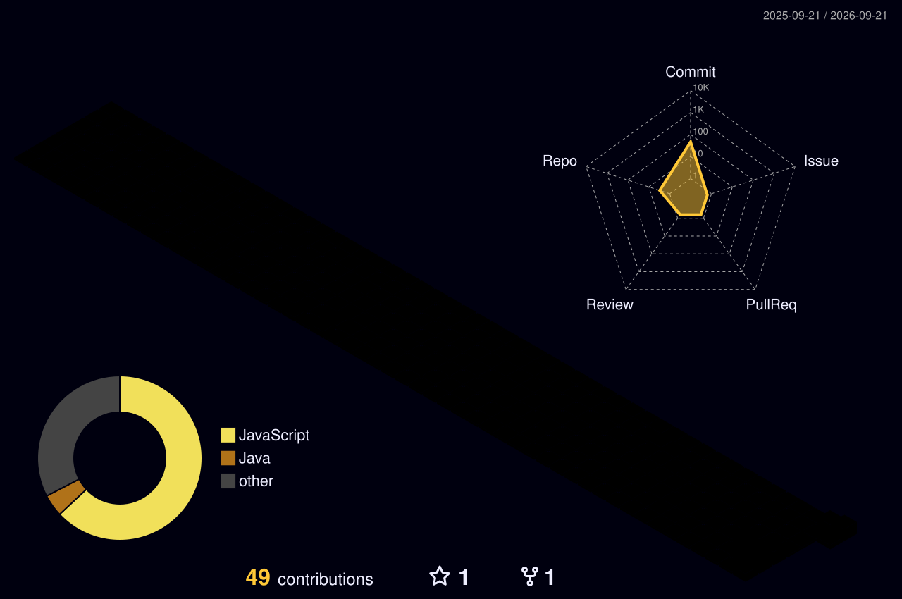

  

  

 

  
  &nbsp;
  
  &nbsp;
  
  &nbsp;
  

 

  

  
  
  

  

## About

Full-stack engineer on production web systems at **INTELLEON**.  
Work covers **APIs**, **databases**, and **React** UIs — with focus on backend design and query performance.

 

&nbsp;

&nbsp;

  

**Education**  
BSc (Hons) Computing (Top-Up) · Wrexham University, UK · 2026  
GDSE · IJSE, Panadura · 2022–2023  
A/L Maths · Vidyarthna University College, Horana · 2020

 

**Stack I use most** · Java · Spring Boot · Node.js · React · PostgreSQL  
**Based in** · Bandaragama, Sri Lanka

---
## Tech Stack

 

    
    
    
  

---

## 2026 Roadmap

  
  
  

  
  
  

  
  
  

---

## GitHub Analytics

  

 

  
  
  

## Contribution Snake

  <picture>
    <source media="(prefers-color-scheme: dark)" srcset="https://raw.githubusercontent.com/Viraj-Lakshitha12/Viraj-Lakshitha12/output/github-contribution-grid-snake-dark.svg" />
    <source media="(prefers-color-scheme: light)" srcset="https://raw.githubusercontent.com/Viraj-Lakshitha12/Viraj-Lakshitha12/output/github-contribution-grid-snake.svg" />
    
  </picture>

---

## 3D Contribution Graph

  

---

## Systems I care about

| Area | What I optimize for |
|:----:|:--------------------|
| **APIs** | Clear contracts · Swagger docs · stable versioning |
| **Data** | Query plans · indexes · Redis where latency matters |
| **Runtime** | Node + Spring services that stay fast under load |
| **Delivery** | Docker-ready paths · clean boundaries · maintainable code |

  
  
  

---

## Education

  

 

| Step | Program | Institute | Year |
|:----:|:--------|:----------|:----:|
| **01** | G.C.E. Advanced Level — **Maths Stream** | Vidyarthna University College, Horana | **2020** |
| **02** | Graduate Diploma in Software Engineering (**GDSE**) | IJSE, Panadura | **2022–2023** |
| **03** | **BSc (Hons) in Computing (Top-Up)** | Wrexham University, UK · Londontec | **2026** |

## Connect

  
  
  
  

  
  

---

  

